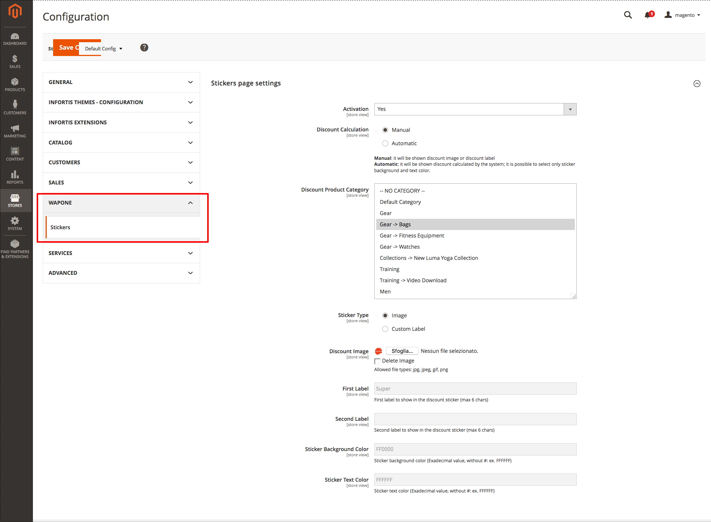

 **WaPoNe Stickers** is a Magento 2 extension to provide product image stickers visible everywhere in the store (category page, product page, result page, related/upsell/crossell, widget). **Depending on the theme installed, it could need some style improvements.**

## Installation

### Composer

Run the following command in Magento 2 root folder

```
composer require wapone/module-stickers
php bin/magento setup:upgrade
php bin/magento setup:static-content:deploy
```

## User Guide

### Configuring extension

1. Go to STORES - WAPONE - Stickers.

2. Set *Activation* to 'YES'.
3. You have to decide to use *Manual* or *Automatic* as *Discount Calculation* 
(**Manual**: it will be shown discount image or discount label ** - **
**Automatic**: it will be shown discount calculated by the system; it is possible to select only sticker background and text color.)
4. Select *Discount Product Category* (one or more) where to apply sticker (used only for **Manual** case)
5. Select *Sticker Type* (**Image** or **Custom Label**)
6. Upload the discount image
7. Set *First Label* (used for **Manual** and **Custom Label** case)
8. Set *Second Label* (used for **Manual** and **Custom Label** case)
9. Set *Sticker Background Color* (used for **Custom Label** case)
10. Set *Sticker Text Color* (used for **Custom Label** case)

## Compability

- Magento CE:
  - 2.1.x
